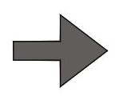
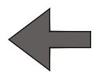
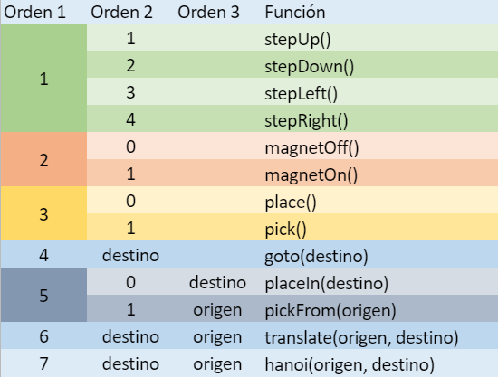

# Controlador para grúa

El proyecto pretende ofrecer una interfaz para el manejo de una grúa de 3 estaciones presente en el Laboratorio De Telemática de la [Universidad EAFIT](http://www.eafit.edu.co/).

## Comenzando 🚀

Clone o descargue el repositorio para continuar.

### Pre-requisitos 📋

#### Hardware
- [Arduino Mega 2560](https://store.arduino.cc/usa/mega-2560-r3).

#### Software
- [IDE de Arduino](https://www.arduino.cc/en/Main/Software).
- [Python 3 (versión sugerida: 3.7.3)](https://www.python.org/downloads/). Para acceder a una guía detallada de cómo descargar e instalar Python, haga click [aquí](https://es.wikihow.com/instalar-Python).
- La librería pySerial (para comunicación Serial) para Python. Para instalarla debe ejecutar `pip install pyserial` (o `pip install --user pyserial` en caso de tener Python instalado localmente) en su terminal de comandos (recordar que debe tener Python instalado y agregado al PATH).

### Instalación 🔧

1. Abra el archivo [ControladorGrua.ino](ControladorGrua/ControladorGrua.ino) con el IDE de Arduino. Luego, en Herramientas, seleccione la placa `Arduino/Genuino Mega or Mega 2560`.
2. Conecte su Arduino mediante el puerto USB, y posteriormente, conecte y configure los pines del Arduino para que concidan con los de la Grúa.
3. Nuevamente en Herramientas, seleccione el puerto que le corresponde a su placa. Tenga en cuenta cuál puerto escogió, más adelante se utilizará.

4. Compile y suba el código a su Arduino. Ya puede cerrar el IDE de Arduino.
Si la grúa esta encendida y se mueve hacia la derecha y luego hacia la izquierda, significa que vamos bien.
5. Abra el archivo [InterfazGrua.py](InterfazGrua.py) en su editor de código o IDE favorito, lueg, en la línea 7, cambie `'COM7'` por el código del puerto que usted identificó en en paso 3 (Para el ejemplo, la línea debería quedar `port = 'COM4'`).
6. Ejecute el programa de la interfaz escribiendo en su terminal `python InterfazGrua.py` (o un IDE que ejecute código en Python, si lo dispone).

¡Listo!, ya puede probar su grúa.

**Nota:** Al momento de ejecutar el programa de Python, es recomendable NO tener abierto el IDE de Arduino o cualquier otro programa que utilice los puertos seriales.

## Instrucciones de la interfaz ⌨️

### Controles manuales ️🔩

El botón se una para hacer que la grúa suba desde su posición actual por 150 milisegundos.

---

El botón se una para hacer que la grúa baje desde su posición actual por 150 milisegundos.

---

El botón se una para hacer que la grúa vaya hacia la derecha desde su posición actual por 150 milisegundos.

---

El botón se una para hacer que la grúa vaya hacia la izquierda desde su posición actual por 150 milisegundos.

---

El botón se una para hacer que la grúa vaya hacia la izquierda desde su posición actual por 150 milisegundos.

---

 

El botón funciona como un toggle, haciendo que la grúa baje desde su posición actual, energice o desenergice el imán (según sea requerido), y posteriormente suba para luego parar.

---

### Controles por estaciones (automáticos) 📦

La sección `Coger de` le permite escoger una estación y coger una ficha (_si es que la hay_), para luego quedarse estática; hasta que, en la sección `Llevar hasta`, pueda escoger una estación en dónde dejar la ficha anteriormente recogida.

---

La sección `Transportar desde, hasta` le permite realizar la acción conjunta de escoger una estación de origen y una de destino para transportar una ficha (_si es que la hay_). Notar que es una combinación de `Coger de` y `Llevar hasta`.

---

La sección `Ir hasta` le permite escoger una estación mediante los botones `P1`, `P2` y `P3` e ir a ella de forma rápida. Es recomendable usar esta opción junto con el botón `Coger/Poner`, explicado en la sección de controles manuales.

---

Con el botón `Jugar Hanoi`, usted solo tendrá que escoger un origen y un destino para que la grúa haga lo suyo. 

___NOTA:___ El juego sólo está disponible con 3 piezas, y usted deberá poner la torre inicial antes de comenzar a jugar.

## Protocolos de Comunicación 🛠️

La interfaz se conecta mediante el puerto serial con el Arduino basado en un procolo de comunicaciones unidireccional `Interfaz -> Arduino` con las siguientes reglas de codificación:

- Se enviarán mensajes de 3 (tres) dígitos como máximo.
- El dígito correspondiente a las unidades es considerado como la orden principal, quien orquesta todo (Orden 1).
- El dígito correspondiente a las decenas, es la orden secundaria u información requerida (Orden 2).
- El dígito correspondiente a las centenas, es la información requerida (Orden 3).

A continuación un a tabla que especifica la función de cada orden:

___NOTA:___ La descripción de cada función se encuentra en los comentarios del archivo [ControladorGrua.ino](ControladorGrua/ControladorGrua.ino), justo arriba de la función con el mismo nombre.

## Autores ✒️

* **David Calle Daza** - *201710031010* - [dcalled1](https://github.com/dcalled1)
* **Felipe Ríos Lopez** - *201810136010* - [friosl](https://github.com/friosl)
 

## Licencia 📄

Este proyecto está bajo la Licencia MIT License - mira el archivo [LICENSE](LICENSE) para detalles

## Expresiones de Gratitud 🎁

* Comenta a otros sobre este proyecto 📢
* Invita una cerveza 🍺 a alguien del equipo. 
* Da las gracias públicamente 🤓.
* etc.

---
⌨️ con ❤️ por [Villanuevand](https://github.com/Villanuevand) 😊